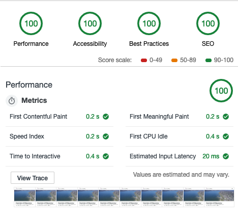

# Doctrine of Discovery
[](LICENSE)

[](https://jekyllrb.com/)

I have become frustrated with how slow and limited in accessibility WordPress is so I decided to start moving sites I administer over to [Jekyll](http://jekyllrb.com) because as static site generator it is faster, more reliable and I have more control over making it accessible..

## Getting Started
[](https://github.com/mmistakes/jekyll-theme-basically-basic/blob/master/LICENSE)
[](https://jekyllrb.com/)
[](https://rubygems.org/gems/jekyll-theme-basically-basic)
[](https://www.paypal.me/mmistakes).

I decided to go with @mmistakes theme [Basically Basic Jekyll Theme](https://github.com/mmistakes/jekyll-theme-basically-basic) because in [Lighthouse](https://developers.google.com/web/tools/lighthouse/). The theme has straight 💯's. If you are reading this stop by and check out the theme and/or support @mmistakes on PayPal.



### Before on WordPress
- Performance: 76%
- Best Practices: 60%
- SEO: 91%
- load time: 12 seconds

### After on Jekyll and Github Pages
- Performance: 100%
- Best Practices: 100%
- SEO: 100%
- load time:
  - 392 ms via [tools.pingdom.com](https://tools.pingdom.com)
  - 0.5s via [GT Metrix](https://gtmetrix.com/)
  - 1.496s via [WebPageTest](https://www.webpagetest.org)

### Basically Basic
Basically Basic is a [Jekyll theme](https://jekyllrb.com/docs/themes/) meant as
a substitute for the default [Minima](https://github.com/jekyll/minima), with a
few enhancements thrown in for good measure:

- Clean responsive design with six customizable skins
- Curriculum Vitæ/Resume layout powered by [JSON data](http://registry.jsonresume.org/)
- About page layout
- Site-wide search provided by [Algolia](https://www.algolia.com/) or [Lunr](https://lunrjs.com/).
- Disqus Comments and Google Analytics support
- SEO best practices via [Jekyll SEO Tag](https://github.com/jekyll/jekyll-seo-tag/)

**If you enjoy this theme, please consider [supporting @mmistakes](https://www.paypal.me/mmistakes) for developing and maintaining it.**

[](https://www.paypal.me/mmistakes)
### Prerequisites

- Flat file
- static site
- no filler
- SSL
- Github Pages

## Built With
* [Basically Basic](https://mmistakes.github.io/jekyll-theme-basically-basic/)
* [System Font Stack](https://css-tricks.com/snippets/css/system-font-stack/)
* [Font Awesome 4.7.0](https://fontawesome.com/v4.7.0/)
* [Bootstrap CDN](https://www.bootstrapcdn.com/)

## Modifications
- Normally this theme uses Google Fonts. I removed the Google fonts in order to improve load time and fix some formatting issues. In order to switch [System Font Stack](https://css-tricks.com/snippets/css/system-font-stack/) I modified the following files:

In [`_theme.yml`](_data/theme.yml) I removed:

  ```YAML
  # Google Fonts
  google_fonts:
    - name: "Fira Sans"
      weights: "400,400i,600,600i"
  ```

In [`_variables.scss`](_sass/basically-basic/_variables.scss) I changed the `$base-font-family` line to read as follows:

  ```scss
  $base-font-family: -apple-system, BlinkMacSystemFont, "Segoe UI", Roboto, Helvetica, Arial, sans-serif, "Apple Color Emoji", "Segoe UI Emoji", "Segoe UI Symbol" !default;
  ```

In [`head.html`](_includes/head.html) I removed:

  ```liquid
  
    <link rel="stylesheet" href="https://fonts.googleapis.com/css?family={{ font.name | replace: ' ', '+' }}:{{ font.weights | remove: ' ' }}|">
  
  ```

All of these changes improved the aesthetic and load time. Plus it helped make the mobile `site.title` more responsive on mobile especially for longer titles.

## Credits

### Creator

**Michael Rose**

- <https://mademistakes.com>
- <https://twitter.com/mmistakes>
- <https://github.com/mmistakes>

### Webmaster
[**Adam DJ Brett**](https://github.com/adamdjbrett)

### Contributors
  - Philip P. Arnold
  - Sandra Bigtree
  - Betty Lyons
  - American Indian Law Alliance
  - Indigenous Values Initiative

Please read [humans.txt](humans.txt) for the contributors.


### Icons + Demo Images:

- [Simple Icons](https://simpleicons.org/)
- [Noun Project](https://thenounproject.com)
- [Unsplash](https://unsplash.com/)

### Other:
- System Font Stack
- Doctrine of Discovery Compass Logo by[Font Awesome](https://fontawesome.com)
- [SVGO](https://github.com/svg/svgo)
- [Jekyll](http://jekyllrb.com/)
- [Susy](http://susy.oddbird.net/)
- [Breakpoint](http://breakpoint-sass.com/)

## License

This project is licensed under the MIT License - see the [LICENSE.md](LICENSE.md) file for details. The content is licensed under a [Creative Commons Attribution 4.0 International License](https://creativecommons.org/licenses/by/4.0/).

## Acknowledgments

* Michael Rose
* Philip P. Arnold
* Sandra Bigtree
* Betty Lyons
* Gail Bundy
* Doctrine of Discovery Working Group
